# Use Case Diagram - Uptime Monitor Frontend

## PlantUML Code

```plantuml
@startuml Uptime Monitor Frontend Use Cases

left to right direction
skinparam packageStyle rectangle

actor "Guest User" as Guest
actor "Authenticated User" as User
actor "Admin User" as Admin

rectangle "Uptime Monitor Frontend System" {
  
  ' Authentication & Public Access
  package "Public Access" {
    usecase "View Public Monitors" as UC01
    usecase "View Public Dashboard" as UC02
  }
  
  package "Authentication" {
    usecase "Login" as UC03
    usecase "Logout" as UC04
    usecase "Auto Token Refresh" as UC05
  }
  
  ' Dashboard
  package "Dashboard" {
    usecase "View Dashboard" as UC06
    usecase "View Monitor Statistics" as UC07
    usecase "View Uptime Charts" as UC08
    usecase "View Recent Incidents" as UC09
    usecase "View System Health Status" as UC10
  }
  
  ' Monitor Management
  package "Monitor Management" {
    usecase "View All Monitors" as UC11
    usecase "Create Monitor" as UC12
    usecase "Edit Monitor" as UC13
    usecase "Delete Monitor" as UC14
    usecase "View Monitor Details" as UC15
    usecase "Pause/Resume Monitor" as UC16
    usecase "Search/Filter Monitors" as UC17
    usecase "View Monitor Checks History" as UC18
    usecase "View Monitor by Group" as UC19
  }
  
  ' Incident Management
  package "Incident Management" {
    usecase "View All Incidents" as UC20
    usecase "View Incident Details" as UC21
    usecase "Acknowledge Incident" as UC22
    usecase "Resolve Incident" as UC23
    usecase "Add Incident Notes" as UC24
    usecase "Filter Incidents by Status" as UC25
  }
  
  ' Notification Management
  package "Notification Management" {
    usecase "View Notification Channels" as UC26
    usecase "Create Notification Channel" as UC27
    usecase "Edit Notification Channel" as UC28
    usecase "Delete Notification Channel" as UC29
    usecase "Enable/Disable Channel" as UC30
    usecase "Test Notification" as UC31
  }
  
  ' Logs & Monitoring
  package "Logs & Activity" {
    usecase "View System Logs" as UC32
    usecase "View Monitor Logs" as UC33
    usecase "Filter Logs" as UC34
  }
  
  ' Settings & Configuration
  package "Settings" {
    usecase "View Settings" as UC35
    usecase "Update Profile" as UC36
    usecase "Change Password" as UC37
    usecase "Configure System Settings" as UC38
  }
  
  ' User Management (Admin Only)
  package "User Management" {
    usecase "View All Users" as UC39
    usecase "Create User" as UC40
    usecase "Edit User" as UC41
    usecase "Delete User" as UC42
    usecase "Manage User Roles" as UC43
  }
}

' Guest User relationships
Guest --> UC01
Guest --> UC02

' Authenticated User relationships
User --> UC03
User --> UC04
User --> UC05

User --> UC06
User --> UC07
User --> UC08
User --> UC09
User --> UC10

User --> UC11
User --> UC12
User --> UC13
User --> UC14
User --> UC15
User --> UC16
User --> UC17
User --> UC18
User --> UC19

User --> UC20
User --> UC21
User --> UC22
User --> UC23
User --> UC24
User --> UC25

User --> UC26
User --> UC27
User --> UC28
User --> UC29
User --> UC30
User --> UC31

User --> UC32
User --> UC33
User --> UC34

User --> UC35
User --> UC36
User --> UC37
User --> UC38

' Admin inherits all User capabilities
Admin --|> User

' Admin-specific relationships
Admin --> UC39
Admin --> UC40
Admin --> UC41
Admin --> UC42
Admin --> UC43

' Include relationships
UC06 ..> UC07 : <<include>>
UC06 ..> UC08 : <<include>>
UC06 ..> UC09 : <<include>>
UC06 ..> UC10 : <<include>>

UC15 ..> UC18 : <<include>>

UC03 ..> UC05 : <<include>>

' Extend relationships
UC12 ..> UC16 : <<extend>>
UC13 ..> UC16 : <<extend>>

@enduml
```

## Visual Representation (Mermaid - Alternative)

```mermaid
graph TB
    subgraph Actors
        Guest[Guest User]
        User[Authenticated User]
        Admin[Admin User]
    end
    
    subgraph Public["Public Access"]
        UC01[View Public Monitors]
        UC02[View Public Dashboard]
    end
    
    subgraph Auth["Authentication"]
        UC03[Login]
        UC04[Logout]
        UC05[Auto Token Refresh]
    end
    
    subgraph Dashboard
        UC06[View Dashboard]
        UC07[View Statistics]
        UC08[View Charts]
        UC09[View Recent Incidents]
    end
    
    subgraph Monitors["Monitor Management"]
        UC11[View Monitors]
        UC12[Create Monitor]
        UC13[Edit Monitor]
        UC14[Delete Monitor]
        UC15[View Monitor Details]
        UC16[Pause/Resume Monitor]
    end
    
    subgraph Incidents["Incident Management"]
        UC20[View Incidents]
        UC21[View Incident Details]
        UC22[Acknowledge Incident]
        UC23[Resolve Incident]
    end
    
    subgraph Notifications["Notification Channels"]
        UC26[View Channels]
        UC27[Create Channel]
        UC28[Edit Channel]
        UC31[Test Notification]
    end
    
    subgraph UserMgmt["User Management - Admin Only"]
        UC39[View Users]
        UC40[Create User]
        UC41[Edit User]
        UC42[Delete User]
    end
    
    Guest --> UC01
    Guest --> UC02
    
    User --> UC03
    User --> UC06
    User --> UC11
    User --> UC12
    User --> UC20
    User --> UC26
    
    Admin --> UserMgmt
```

## Use Case Descriptions

### Public Access (Guest)
- **UC01**: View Public Monitors - Melihat daftar monitor yang dipublikasikan tanpa login
- **UC02**: View Public Dashboard - Melihat dashboard publik tanpa autentikasi

### Authentication & Security
- **UC03**: Login - Masuk ke sistem menggunakan email dan password
- **UC04**: Logout - Keluar dari sistem dan hapus token
- **UC05**: Auto Token Refresh - Otomatis refresh JWT token sebelum expired

### Dashboard
- **UC06**: View Dashboard - Melihat halaman dashboard utama
- **UC07**: View Monitor Statistics - Melihat statistik jumlah monitor (total, up, down, paused)
- **UC08**: View Uptime Charts - Melihat grafik uptime 24 jam terakhir
- **UC09**: View Recent Incidents - Melihat timeline incident terbaru
- **UC10**: View System Health Status - Melihat status kesehatan sistem

### Monitor Management
- **UC11**: View All Monitors - Melihat daftar semua monitor
- **UC12**: Create Monitor - Membuat monitor baru (HTTP/HTTPS, PING, PORT, SSL, KEYWORD, HEARTBEAT)
- **UC13**: Edit Monitor - Edit konfigurasi monitor yang sudah ada
- **UC14**: Delete Monitor - Hapus monitor
- **UC15**: View Monitor Details - Melihat detail monitor dan check history
- **UC16**: Pause/Resume Monitor - Pause atau resume monitoring dengan durasi tertentu
- **UC17**: Search/Filter Monitors - Cari dan filter monitor berdasarkan kriteria
- **UC18**: View Monitor Checks History - Melihat history pengecekan monitor
- **UC19**: View Monitor by Group - Melihat monitor berdasarkan group/kategori

### Incident Management
- **UC20**: View All Incidents - Melihat daftar semua incident
- **UC21**: View Incident Details - Melihat detail incident tertentu
- **UC22**: Acknowledge Incident - Tandai incident sebagai acknowledged
- **UC23**: Resolve Incident - Tandai incident sebagai resolved
- **UC24**: Add Incident Notes - Tambah catatan pada incident
- **UC25**: Filter Incidents by Status - Filter incident berdasarkan status (open, acknowledged, resolved)

### Notification Management
- **UC26**: View Notification Channels - Melihat daftar notification channels
- **UC27**: Create Notification Channel - Buat channel baru (Telegram, Discord, Slack, Webhook)
- **UC28**: Edit Notification Channel - Edit konfigurasi channel
- **UC29**: Delete Notification Channel - Hapus notification channel
- **UC30**: Enable/Disable Channel - Aktifkan atau nonaktifkan channel
- **UC31**: Test Notification - Test pengiriman notifikasi ke channel

### Logs & Activity
- **UC32**: View System Logs - Melihat log aktivitas sistem
- **UC33**: View Monitor Logs - Melihat log specific monitor
- **UC34**: Filter Logs - Filter logs berdasarkan kriteria

### Settings & Configuration
- **UC35**: View Settings - Melihat halaman pengaturan
- **UC36**: Update Profile - Update informasi profil user
- **UC37**: Change Password - Ganti password
- **UC38**: Configure System Settings - Konfigurasi pengaturan sistem

### User Management (Admin Only)
- **UC39**: View All Users - Melihat daftar semua users (Admin only)
- **UC40**: Create User - Tambah user baru
- **UC41**: Edit User - Edit informasi user
- **UC42**: Delete User - Hapus user
- **UC43**: Manage User Roles - Kelola role user (admin/regular user)

## Monitor Types Supported

1. **HTTP/HTTPS** - Website monitoring dengan status code check
2. **PING** - ICMP ping monitoring untuk server/device availability
3. **PORT** - TCP/UDP port monitoring
4. **KEYWORD** - Content/keyword monitoring pada website
5. **SSL** - SSL certificate monitoring dan expiry check
6. **HEARTBEAT** - Heartbeat monitoring untuk cron jobs/scheduled tasks

## Notification Channel Types

1. **Telegram Bot** - Notification via Telegram
2. **Discord Webhook** - Notification ke Discord channel
3. **Slack Webhook** - Notification ke Slack workspace
4. **Generic Webhook** - Custom webhook untuk integrasi lain

## Actor Roles

### Guest User
- Dapat mengakses halaman publik
- Tidak perlu autentikasi
- Hanya view-only access

### Authenticated User
- Semua fitur monitoring dan incident management
- CRUD operations untuk monitors
- Notification channel management
- View logs dan settings
- Update profile sendiri

### Admin User
- Semua capability dari Authenticated User
- Plus: User management (CRUD users, manage roles)
- Full system access

## Technology Integration

- **Vue 3** dengan Composition API untuk reactive UI
- **Vue Router** untuk navigation dan route guards
- **Pinia** untuk state management
- **Axios** untuk API communication
- **Chart.js** untuk data visualization
- **JWT** untuk authentication token
