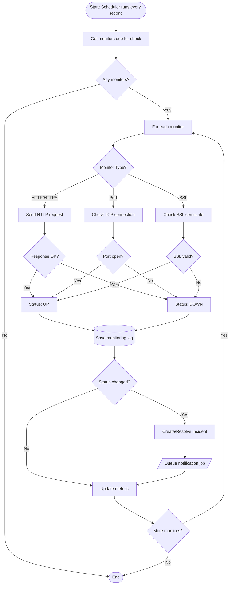
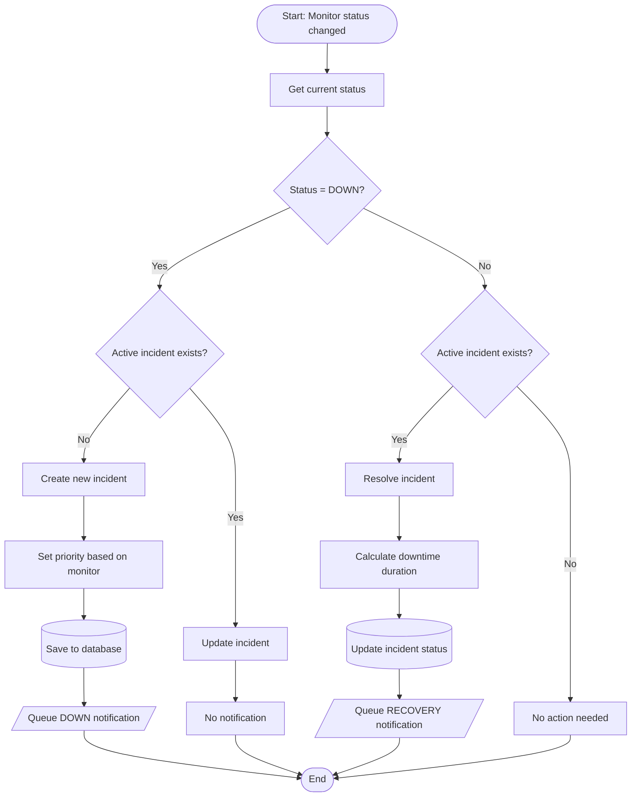
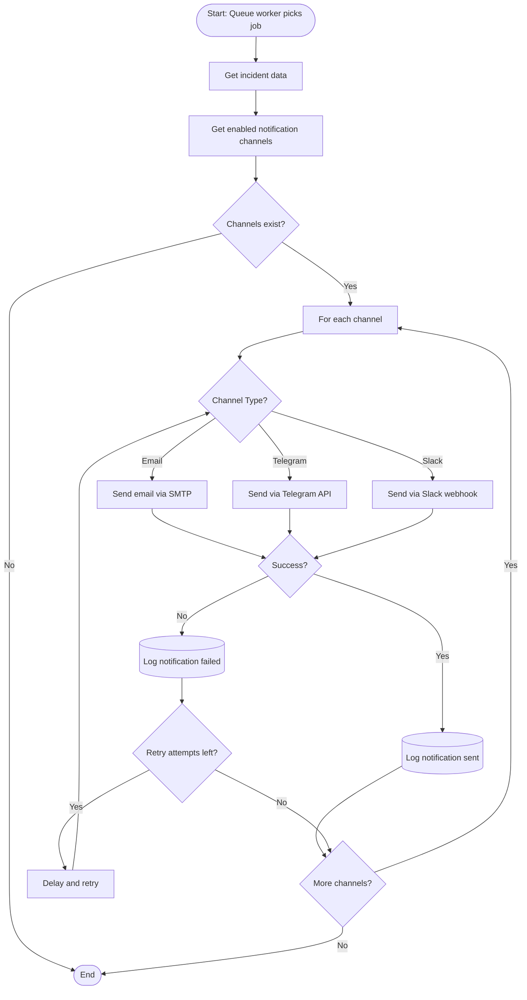
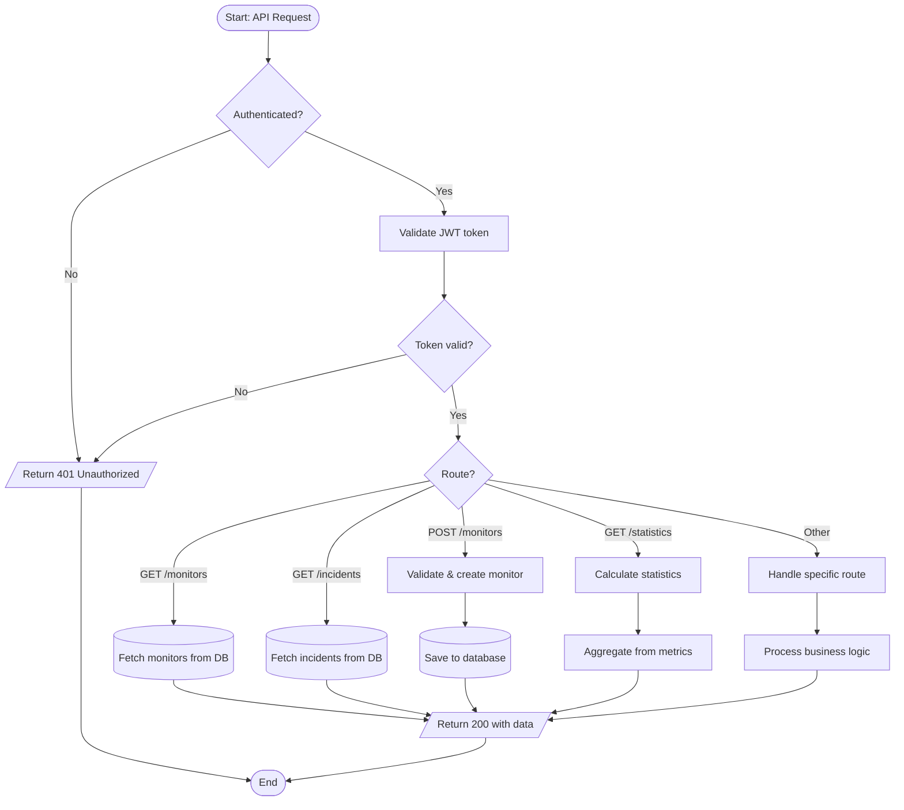
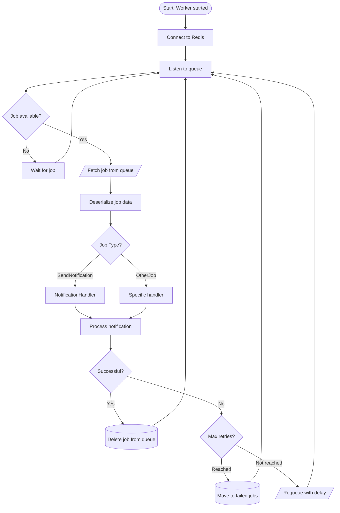
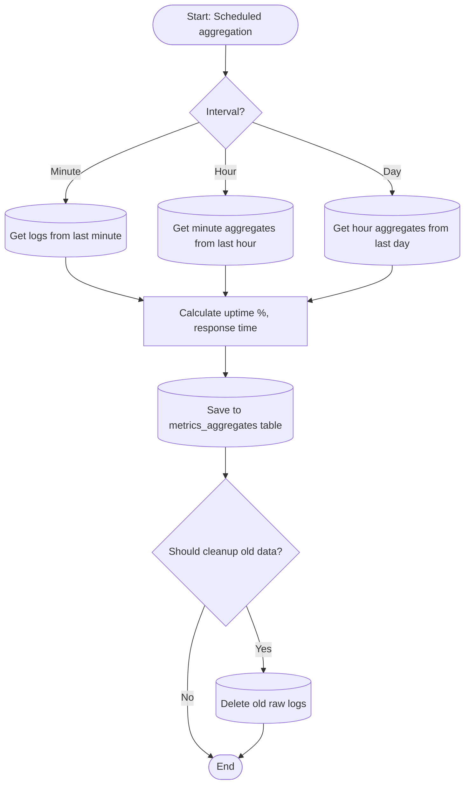
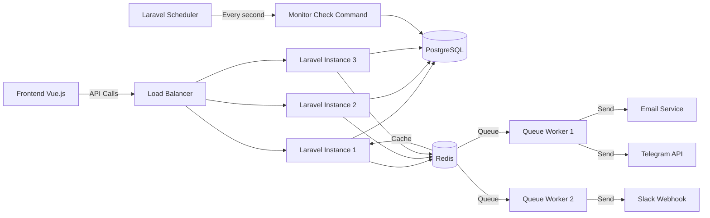

# Backend Flowchart

## 0. Complete End-to-End Flow (Frontend to Backend to Database)

```mermaid
flowchart TD
    Start([Start: User opens app]) --> FrontendLoad[Frontend: Load dashboard]
    FrontendLoad --> DisplayUI[Display Vue.js UI]
    
    subgraph Frontend["FRONTEND (Vue.js)"]
        DisplayUI --> UserAction{User Action?}
        UserAction -->|Create Monitor| OpenForm[Open monitor form]
        UserAction -->|View Dashboard| FetchData[Request monitor list]
        UserAction -->|View Details| FetchDetails[Request monitor details]
        
        OpenForm --> FillForm[User fills monitor info:<br/>Name, URL, Type, Interval]
        FillForm --> ValidateForm{Form valid?}
        ValidateForm -->|No| ShowError[Show validation error]
        ShowError --> FillForm
        ValidateForm -->|Yes| SendCreate[/Send POST /api/monitors<br/>with JWT token/]
    end
    
    subgraph Backend["BACKEND (Laravel API)"]
        SendCreate --> APIReceive[Receive API request]
        FetchData --> APIReceive
        FetchDetails --> APIReceive
        
        APIReceive --> AuthCheck{Valid JWT?}
        AuthCheck -->|No| Return401[/Return 401 Unauthorized/]
        AuthCheck -->|Yes| RouteCheck{Which endpoint?}
        
        RouteCheck -->|POST /monitors| ValidateInput[Validate monitor data]
        RouteCheck -->|GET /monitors| QueryMonitors[(Query monitors table)]
        RouteCheck -->|GET /monitors/:id| QueryDetails[(Query monitor + logs)]
        
        ValidateInput --> InputValid{Valid?}
        InputValid -->|No| Return422[/Return 422 Validation Error/]
        InputValid -->|Yes| SaveMonitor[(INSERT INTO monitors table)]
        
        SaveMonitor --> SetNextCheck[Calculate next_check_at time]
        SetNextCheck --> ReturnSuccess[/Return 201 Monitor created/]
        
        QueryMonitors --> ReturnMonitors[/Return 200 with monitors/]
        QueryDetails --> ReturnDetails[/Return 200 with details/]
    end
    
    subgraph Database["DATABASE (PostgreSQL)"]
        SaveMonitor --> DBMonitors[(monitors table:<br/>id, name, url, type,<br/>interval_seconds,<br/>next_check_at, status)]
        QueryMonitors --> DBMonitors
        QueryDetails --> DBMonitors
        QueryDetails --> DBLogs[(monitoring_logs table)]
    end
    
    ReturnSuccess --> FrontendReceive[Frontend receives response]
    Return422 --> FrontendReceive
    Return401 --> FrontendReceive
    ReturnMonitors --> FrontendReceive
    ReturnDetails --> FrontendReceive
    
    FrontendReceive --> UpdateUI[Update Vue.js UI]
    UpdateUI --> ShowSuccess{Success?}
    ShowSuccess -->|Yes| RefreshList[Refresh monitor list]
    ShowSuccess -->|No| ShowAPIError[Show error message]
    
    RefreshList --> WaitScheduler[Monitor saved, waiting for scheduler]
    
    subgraph Scheduler["SCHEDULER (Laravel Command)"]
        WaitScheduler --> SchedulerRun([Scheduler runs every second])
        SchedulerRun --> CheckDue[(Query monitors WHERE<br/>next_check_at <= NOW)]
        CheckDue --> MonitorFound{Monitors found?}
        MonitorFound -->|Yes| RunCheck[Execute monitor check]
        MonitorFound -->|No| WaitNext[Wait next second]
        WaitNext --> SchedulerRun
        
        RunCheck --> CheckMonitorType{Monitor type?}
        CheckMonitorType -->|HTTP| HTTPRequest[Send HTTP GET request]
        CheckMonitorType -->|Port| PortConnect[Try TCP connection]
        CheckMonitorType -->|SSL| SSLCheck[Check SSL certificate]
        
        HTTPRequest --> EvalResponse{Status 200<br/>& timeout OK?}
        PortConnect --> EvalPort{Port open?}
        SSLCheck --> EvalSSL{SSL valid<br/>& not expired?}
        
        EvalResponse -->|Yes| StatusUp[Status: UP]
        EvalResponse -->|No| StatusDown[Status: DOWN]
        EvalPort -->|Yes| StatusUp
        EvalPort -->|No| StatusDown
        EvalSSL -->|Yes| StatusUp
        EvalSSL -->|No| StatusDown
        
        StatusUp --> SaveLog[(INSERT INTO monitoring_logs)]
        StatusDown --> SaveLog
        
        SaveLog --> UpdateMonitor[(UPDATE monitors SET<br/>status, last_check_at,<br/>next_check_at)]
        UpdateMonitor --> CheckStatusChange{Status changed?}
        
        CheckStatusChange -->|Yes| TriggerIncident[(INSERT/UPDATE incidents)]
        CheckStatusChange -->|No| UpdateMetrics[Update metrics]
        
        TriggerIncident --> QueueNotification[(INSERT INTO jobs queue)]
        QueueNotification --> UpdateMetrics
        UpdateMetrics --> SchedulerRun
    end
    
    subgraph QueueWorker["QUEUE WORKER"]
        QueueNotification --> WorkerPick[Worker picks job from Redis]
        WorkerPick --> ProcessNotif[Process notification]
        ProcessNotif --> SendChannels[Send to Email/Telegram/Slack]
        SendChannels --> LogNotification[(INSERT INTO notification_logs)]
        LogNotification --> DeleteJob[Delete job from queue]
    end
    
    subgraph FrontendPolling["FRONTEND (Real-time Updates)"]
        DeleteJob --> PollInterval[Frontend polls every 10s]
        UpdateMetrics --> PollInterval
        PollInterval --> FetchLatest[/GET /api/monitors/]
        FetchLatest --> APIReceive
    end
    
    ShowAPIError --> End([End])
    RefreshList --> End
```

## 1. Monitor Checking Flow

## 2. Incident Detection Flow

## 3. Notification Processing Flow

## 4. API Request Flow

## 5. Queue Job Processing

## 6. Metrics Aggregation Flow

## System Architecture

## Flowchart Symbol Legend

| Symbol | Shape | Description |
|--------|-------|-------------|
| `([...])` | Oval/Terminator | Start/End program |
| `[...]` | Rectangle | Process/Action |
| `{...}` | Diamond | Decision/Condition |
| `[(...))]` | Cylinder | Database operation |
| `[/..../]` | Parallelogram | Input/Output |

## Complete System Flow Summary

### Monitor Creation Flow
1. **Frontend** - User fills form and submits
2. **API** - Validates and saves to database
3. **Database** - Stores monitor configuration
4. **Response** - Frontend shows success/error

### Monitor Checking Flow
1. **Scheduler** - Runs every second, queries due monitors
2. **Check Execution** - HTTP/Port/SSL check performed
3. **Database** - Save log and update monitor status
4. **Incident Detection** - Create/resolve incidents on status change
5. **Queue** - Notification job queued

### Notification Flow
1. **Queue Worker** - Picks job from Redis
2. **Send** - Delivers to Email/Telegram/Slack
3. **Log** - Records notification result

### Frontend Updates
1. **Polling** - Frontend requests updates every 10 seconds
2. **API** - Returns latest monitor status
3. **UI** - Updates dashboard display
