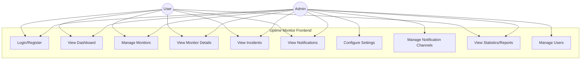
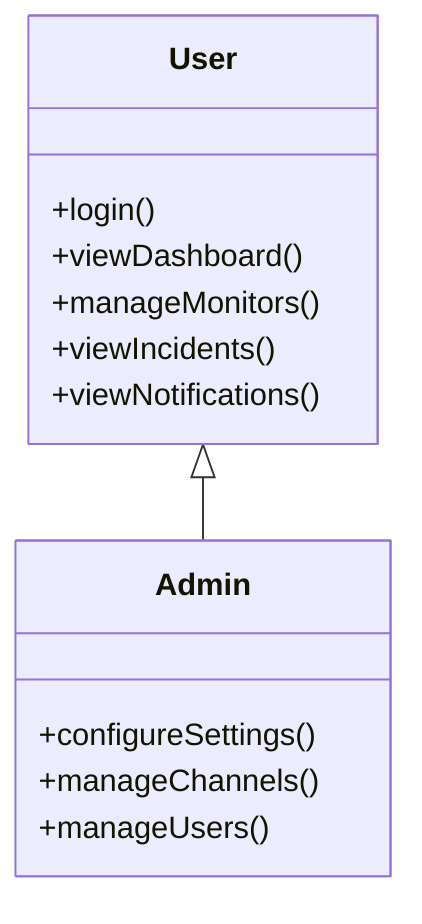

# Frontend Use Case Diagram

## Use Cases

### User
1. **Login/Register** - Authenticate to system
2. **View Dashboard** - See all monitors status and uptime
3. **Manage Monitors** - Create, edit, delete monitors
4. **View Monitor Details** - Check specific monitor statistics
5. **View Incidents** - See incident history
6. **View Notifications** - Check notification logs
7. **View Statistics/Reports** - Analyze uptime data

### Admin
All User capabilities plus:
8. **Configure Settings** - System configuration
9. **Manage Notification Channels** - Email, Telegram, Slack setup
10. **Manage Users** - User management

## Actor Relationships

